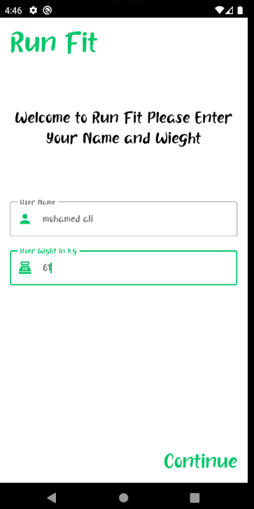
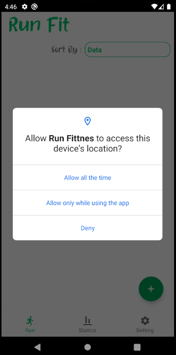
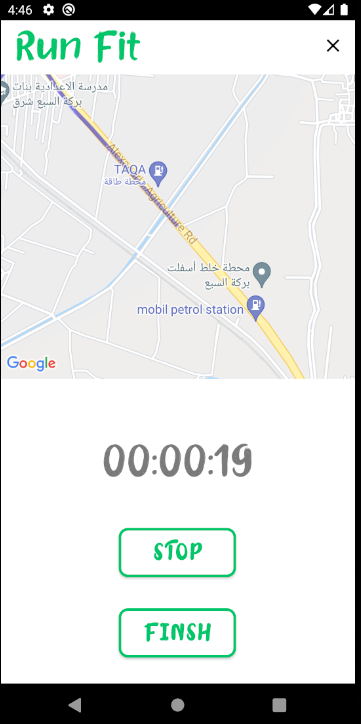
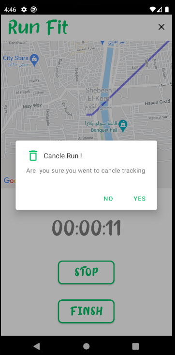
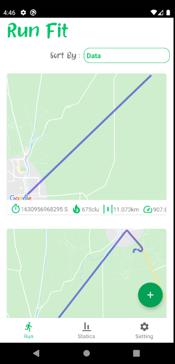
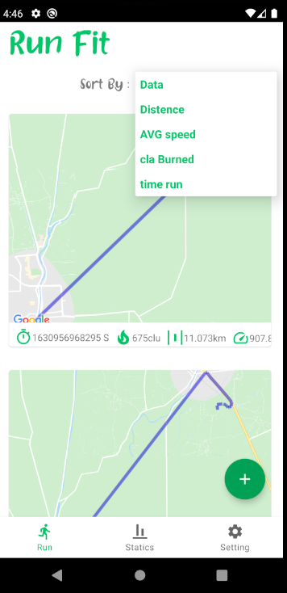
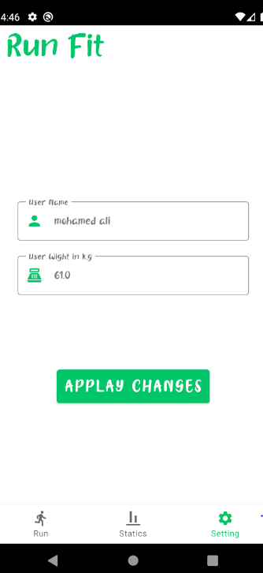
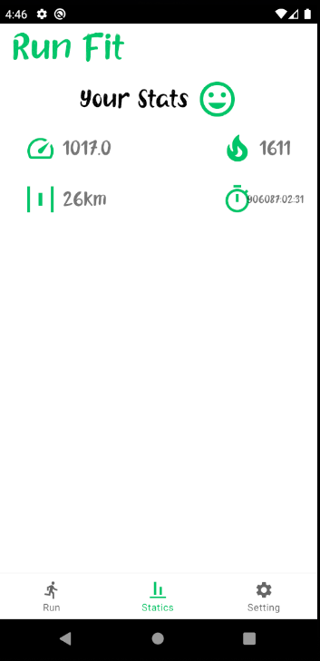
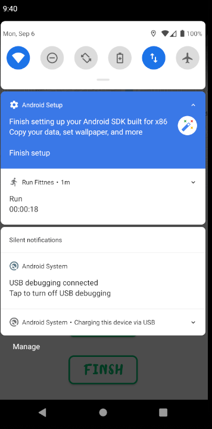

# Run Fittnes

## features
- save name and wight in sheared Prefrences
- start Tracking your run and pause and resume
- show tracking inside notification
- tracking with phone in sleep mode
- save in Run in room database
- adjust name and wight and updated
- show your statics run

## Technology i used it
- room db
- map api 
- foreground services
- notification
- Navigation component
- Live Data
- Dependency injection (hilt degger)
- Coroutine
- databinding , viewbinding

 

## setup name and wight 🌴🌴

 
 

## ask for permission 🌴🌴

 
 

## run screen for start run or pause or finsh or cancle run 🌴🌴

 
 

## cancle run 🌴🌴

 
 

## this is main screen show you all run 🌴🌴

 
 

## you can sort recycle by yor avg speed and time ....... 🌴🌴

 
 

## updata your name or wight 🌴🌴

 
 

## screen show you your statics and yor progress 🌴🌴

 
 

## tracking with phone in sleep mode with notification 🌴🌴

 
 
